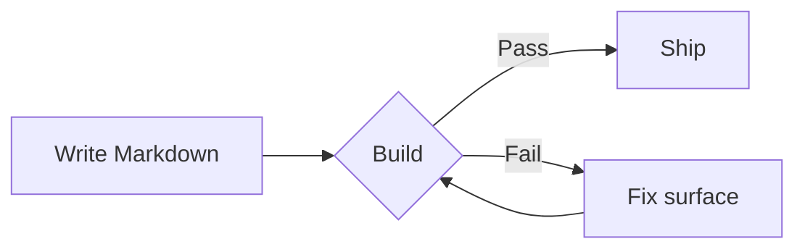

---
tags:
  - Theme QA
  - Components
---

# Kitchen sink

This page puts the busiest theme surfaces in one place. Use it to check actions,
tabs, code blocks, annotations, grids, tables, footnotes, charts, and footer
navigation.

[Primary action](#buttons){ .button .primary }
[Secondary action](#buttons){ .button .secondary }
[Outline action](#buttons){ .button .outline }
[Ghost action](#buttons){ .button .ghost }

## Long table of contents entry that should truncate cleanly

Inline code like `Dockerfile`, `zensical.toml`, and `--accent` should remain
readable inside paragraphs and links such as [`Dockerfile`](#code-actions).
Footnotes stay quiet but reachable.[^note]

[^note]:
    This footnote deliberately contains `inline code`, a [link](#buttons), and
    enough text to verify tooltip width, spacing, and line-height.

### Nested heading with a similarly long label for right rail pressure

The right rail should show nested headings without colliding with the page title
or clipping labels.

## Buttons

Use this section to compare prose buttons with header actions, content actions,
code actions, and footer navigation.

[Default](#buttons){ .button }
[Small](#buttons){ .button .sm }
[Extra small](#buttons){ .button .xs }
[Large](#buttons){ .button .lg }
[Destructive](#buttons){ .button .destructive }
[Link style](#buttons){ .button .link }

## Admonitions

!!! note "Neutral note"
    Notes should read clearly without a heavy background.

??? tip "Collapsed tip should align its icon and chevron"
    The collapsed row keeps icon, text, and chevron vertically centered.
    Expanded content should not jump or clip.

!!! warning "Temporary limitation"
    Warning colors should be legible in light and dark mode.

!!! danger "High attention"
    Danger should be clear without overpowering the page.

## Code actions

```toml title="zensical.toml" linenums="1"
[project]
site_name = "Kitchen sink"

[project.theme]
name = "alloy"
features = ["content.code.copy", "content.code.annotate"] # (1)!
```

1.  The annotation popover should not overlap the next heading or make the code
    action buttons cover the text.

### Code block immediately after annotation

```python
def render_chart(values: list[int]) -> dict[str, object]:
    return {
        "xAxis": {"type": "category", "data": ["Mon", "Tue", "Wed"]},
        "yAxis": {"type": "value"},
        "series": [{"type": "bar", "data": values}],
    }
```

## Content tabs

=== "Python"

    ```python
    print("tabs with code should sit close to their block")
    ```

=== "TypeScript"

    ```ts
    console.log("copy buttons should not overlap text")
    ```

=== "Markdown list"

    - First item
    - Second item with `inline code`
    - Third item

## Grid stress

<div class="grid cards" markdown>

-   **Card with list**

    - Compact spacing
    - No outer result border
    - Stable hover state

-   **Card with code**

    ```yaml
    theme:
      name: alloy
    ```

-   **Card with callout**

    !!! info "Inside a grid"
        Nested callouts should keep their radius and spacing.

</div>

<div class="grid" markdown>

=== "Unordered list"

    - Sed sagittis eleifend rutrum
    - Donec vitae suscipit est
    - Nulla tempor lobortis orci

=== "Ordered list"

    1. Sed sagittis eleifend rutrum
    2. Donec vitae suscipit est
    3. Nulla tempor lobortis orci

``` title="Content tabs source"
=== "Unordered list"

    - Sed sagittis eleifend rutrum
    - Donec vitae suscipit est
    - Nulla tempor lobortis orci

=== "Ordered list"

    1. Sed sagittis eleifend rutrum
    2. Donec vitae suscipit est
    3. Nulla tempor lobortis orci
```

</div>

## Tables and tasks

| Surface | Risk | Expected behavior |
| --- | --- | --- |
| Header actions | Crowding | Equal height and quiet hover |
| Code actions | Overlap | Reserved right-side space |
| Footer nav | Oversized controls | Compact previous and next links |

- [x] Completed task
- [ ] Incomplete task with `inline code`
- [ ] Long incomplete task that wraps onto another line without moving the
  checkbox out of alignment

## Mermaid



## Steps

<ol class="alloy-steps" markdown>

1. **Install** the package.

    ```bash
    pip install zensical-alloy
    ```

2. **Configure** the theme in `zensical.toml`.

    ```toml
    [project.theme]
    name = "alloy"
    ```

3. **Build and serve** the site.

</ol>

## Property table

<table class="alloy-properties" markdown>

| Name                | Type  | Default    | Description                                                  |
| ------------------- | ----- | ---------- | ------------------------------------------------------------ |
| `accent_preset`     | `str` | unset      | One of `orange`, `slate`, `cyan`, `violet`                   |
| `accent_color`      | `str` | unset      | Optional light-scheme override in any CSS color form         |
| `accent_color_dark` | `str` | unset      | Optional dark-scheme override in any CSS color form          |
| `radius`            | `str` | `0.625rem` | Border radius for controls and surfaces                      |
| `content_width`     | `str` | `46rem`    | Article max-width; override per page with `alloy_layout`     |

</table>

## Chart block

<div class="zensical-echarts" markdown>

```json
{
  "tooltip": { "trigger": "axis" },
  "grid": { "left": 32, "right": 16, "top": 24, "bottom": 28 },
  "xAxis": { "type": "category", "data": ["Docs", "Theme", "QA", "Ship"] },
  "yAxis": { "type": "value" },
  "series": [
    {
      "type": "bar",
      "data": [22, 31, 26, 38],
      "itemStyle": { "borderRadius": [6, 6, 0, 0] }
    }
  ]
}
```

</div>
