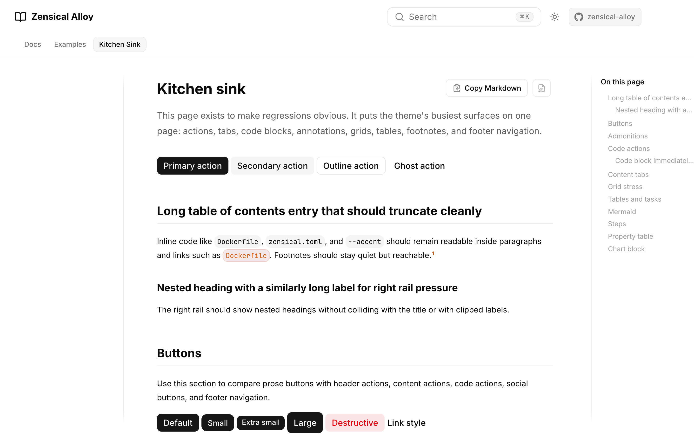
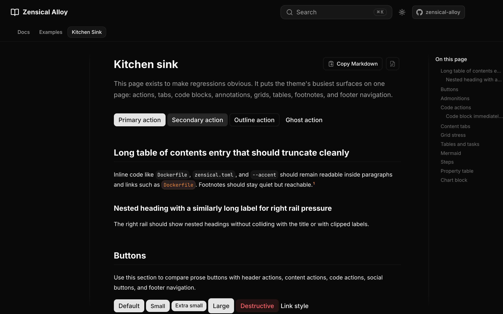
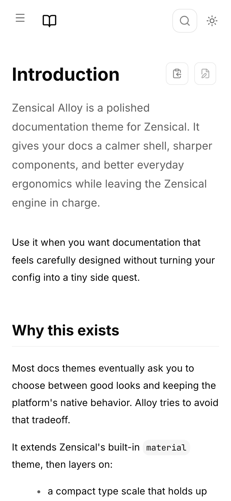
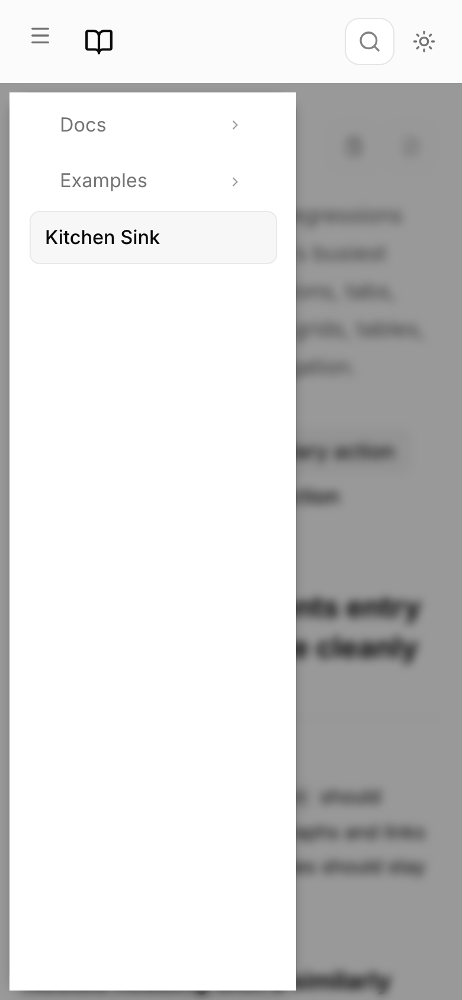
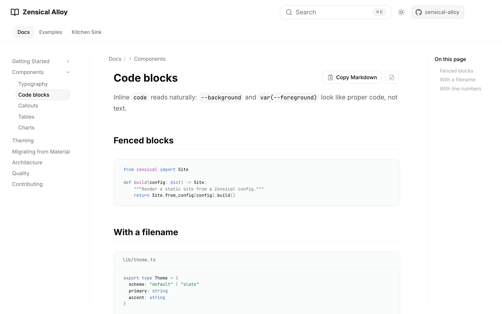
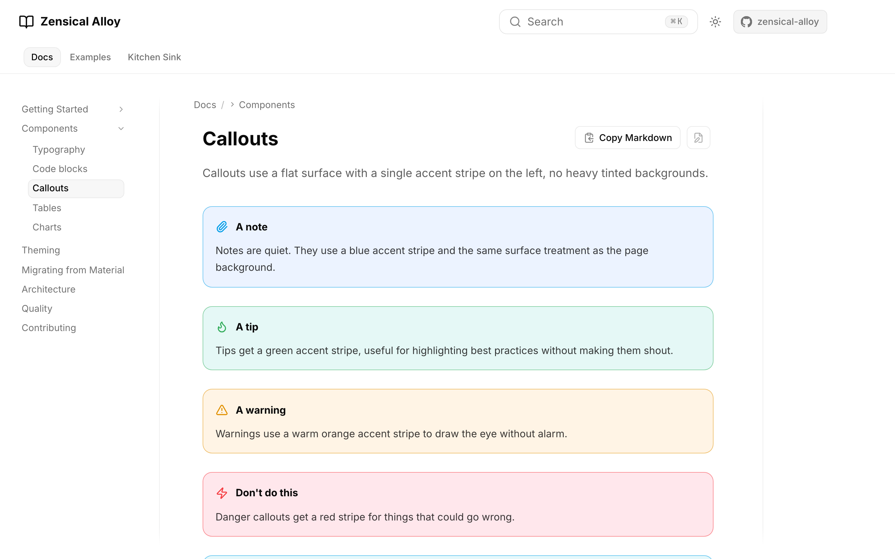
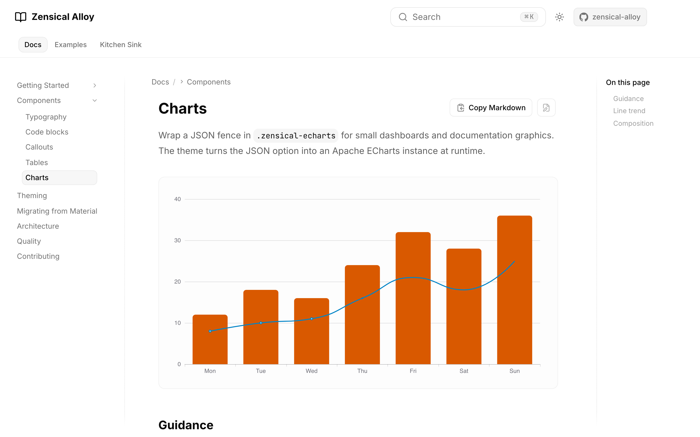

# Zensical Alloy

A documentation theme for Zensical. Alloy keeps Material's runtime behavior and
reworks the visual layer: header, navigation, typography, code blocks, callouts,
tables, tabs, charts, and mobile layout.

[Get started](getting-started/index.md){ .button .primary }
[View components](components/index.md){ .button .outline }
[Migration notes](migrating.md){ .button .ghost }

{ .alloy-screenshot loading=lazy }

## Minimal Setup

```bash
pip install zensical-alloy
```

```toml
[project.theme]
name = "alloy"
```

Existing Material-style configuration continues to work because Alloy extends
Material instead of replacing it.

## What You Get

<div class="grid cards" markdown>

-   __Material behavior stays intact__

    Search, instant navigation, code annotations, footnotes, content tabs,
    palette switching, and plugins keep using the upstream runtime.

-   __A quieter interface__

    The header, side navigation, right TOC, footer, and page actions are compact
    and consistent across light and dark mode.

-   __Documentation components__

    Code blocks, callouts, tables, tabs, buttons, task lists, Mermaid diagrams,
    and ECharts blocks share the same visual language.

-   __Small theme knobs__

    Set accent colors, radius, fonts, and layout widths from
    `[project.extra.alloy]`.

</div>

## Screenshots

=== "Light"

    { .alloy-screenshot loading=lazy }

=== "Dark"

    { .alloy-screenshot loading=lazy }

=== "Mobile"

    <div class="grid" markdown>

    { .alloy-screenshot loading=lazy }

    { .alloy-screenshot loading=lazy }

    </div>

=== "Code"

    { .alloy-screenshot loading=lazy }

=== "Callouts"

    { .alloy-screenshot loading=lazy }

=== "Charts"

    { .alloy-screenshot loading=lazy }

## Next Steps

<div class="grid cards" markdown>

-   __[Getting started](getting-started/index.md)__

    Install the package, enable the theme, and run a local site.

-   __[Configuration](getting-started/configuration.md)__

    Set palette, fonts, layout widths, and feature flags.

-   __[Theming](theming.md)__

    Review the public Alloy options and token override path.

-   __[Migrating from Material](migrating.md)__

    See what Alloy preserves, what it restyles, and how to roll back.

</div>
