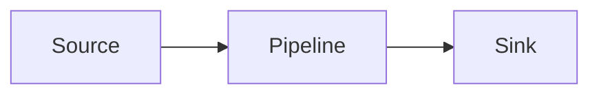

# Theming

Alloy uses semantic CSS tokens for color, radius, spacing, and type. Components
read from those tokens, so a small set of options can change the whole theme.

Most projects only need the options under `[project.extra.alloy]`.

## Pick An Alloy Accent Preset

`accent_preset` is Alloy's short list of curated light and dark accent pairs.
It is separate from Material's named `palette.accent` values.

```toml
[project.extra.alloy]
accent_preset = "slate"
```

| Preset | Light | Dark |
| --- | --- | --- |
| `orange` | `oklch(0.62 0.18 46)` | `oklch(0.74 0.16 56)` |
| `slate` | `oklch(0.55 0.04 240)` | `oklch(0.74 0.03 240)` |
| `cyan` | `oklch(0.6 0.13 200)` | `oklch(0.78 0.11 200)` |
| `violet` | `oklch(0.55 0.2 290)` | `oklch(0.74 0.15 295)` |

If you set `accent_color` or `accent_color_dark`, that exact color wins for
that scheme.

## Use Material Palette Accents

Projects that already set `palette.accent` can keep that configuration. Alloy
maps Material accent names to OKLCH values and adjusts each scheme for readable
prose contrast. Material uses hyphenated names for multi-word accents, such as
`deep-purple` and `light-blue`.

```toml
[[project.theme.palette]]
scheme = "default"
accent = "deep-purple"

[[project.theme.palette]]
scheme = "slate"
accent = "amber"
```

Use optional exact-color overrides when the brand color must be exact:

```toml
[project.extra.alloy]
accent_color = "#5b5ef7"
accent_color_dark = "#8f91ff"
```

Accent precedence is:

1. Scheme-specific `accent_color` or `accent_color_dark` overrides
2. `accent_preset`
3. `palette.accent`
4. Alloy defaults

## Public Options

| Option | Default | Scope |
| --- | --- | --- |
| `accent_preset` | unset | Both color schemes |
| `accent_color` | unset | Optional light-scheme override |
| `accent_color_dark` | unset | Optional dark-scheme override |
| `radius` | `0.625rem` | Controls and surfaces |
| `font_sans` | `"Inter", ui-sans-serif, system-ui` | Body, headings, UI |
| `font_mono` | `"JetBrains Mono", ui-monospace` | Code and keyboard text |
| `content_width` | `46rem` | Article max width |
| `sidebar_width` | `clamp(10rem, 18vw, 14.5rem)` | Left navigation |
| `toc_width` | `clamp(9rem, 15vw, 13rem)` | Right TOC |
| `top_nav_accent` | `false` | Active top tab color |

## Layout Widths

Use the layout options when a project has dense navigation or wide reference
content.

```toml
[project.extra.alloy]
content_width = "50rem"
sidebar_width = "clamp(11rem, 18vw, 15rem)"
toc_width = "clamp(9rem, 14vw, 12rem)"
```

For a single wide page, use front matter:

```yaml
---
title: System overview
alloy_layout: wide
---
```

`wide` expands the article width to `60rem` for that page.

## Fonts

Set `font_sans` and `font_mono` when you want project-specific fonts.

```toml
[project.extra.alloy]
font_sans = "\"Geist\", ui-sans-serif, system-ui"
font_mono = "\"Geist Mono\", ui-monospace, monospace"
```

If your project disables Material font loading with `font: false`, set these
options to system stacks.

## Buttons

Alloy uses the standard Material button attribute syntax:

```markdown
[Primary](#){ .button .primary }
[Secondary](#){ .button .secondary }
[Outline](#){ .button .outline }
[Ghost](#){ .button .ghost }
[Danger](#){ .button .destructive }
```

Size modifiers are available when needed:

```markdown
[Small](#){ .button .sm }
[Large](#){ .button .lg }
```

## Steps

Use `alloy-steps` for short setup or process lists.

<ol class="alloy-steps" markdown>

1. Install the package.

    ```bash
    pip install zensical-alloy
    ```

2. Set the theme name.

    ```toml
    [project.theme]
    name = "alloy"
    ```

3. Build the site.

</ol>

Add `alloy-steps--done` to mark every step complete, or `class="done"` on one
item to mark a single completed step.

## Property Tables

Use `alloy-properties` for option reference tables.

<table class="alloy-properties" markdown>

| Name | Type | Default | Description |
| --- | --- | --- | --- |
| `accent_preset` | `str` | unset | Preset accent pair |
| `radius` | `str` | `0.625rem` | Surface and control radius |
| `content_width` | `str` | `46rem` | Article width |

</table>

## Charts And Diagrams

ECharts blocks use `--brand-accent` for the first series and muted supporting
colors for later series. Tooltips stay inside the chart layer and charts update
when the color scheme changes.

Mermaid diagrams inherit Alloy's neutral palette. Add `class="alloy-accent"` to
a node when it needs emphasis.



## Raw Token Overrides

Use raw CSS only when the public knobs are not enough.

```css
:root {
  --background: oklch(0.99 0.005 85);
  --brand-accent: oklch(0.55 0.22 280);
}
```

Prefer semantic tokens such as `--background`, `--foreground`, `--muted`,
`--brand-accent`, `--surface`, and `--border`. Per-component overrides are more
fragile.

## Minimal Example

```toml
[project.theme]
name = "alloy"

[project.extra.alloy]
accent_preset = "cyan"
radius = "0.75rem"
content_width = "48rem"
```
